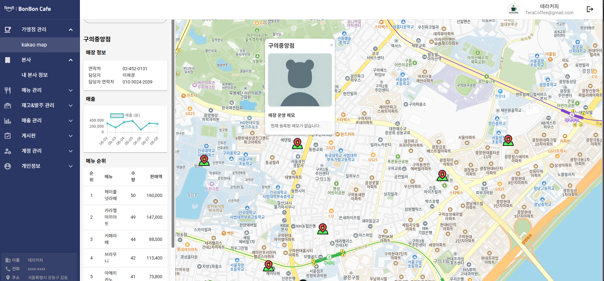

# 이제경 포트폴리오

## 개인정보

| **이름**   | 이제경 |
|-------------|----------|
| **깃허브** | [github.com/jelee55](https://github.com/jelee55) |
| **생일**   | 1997-01-21 |
| **메일**   | jegyeong25@gmail.com |

## 기술 스택

### Backend
      

### Frontend
       

### Database
  

### Tools
        

### Server
 

### Communication
  

BonBon – 가맹점 통합 관리 웹 플랫폼
==================================
📆 2025.04 ~ 2025.06  
👪 BE/FE 4명  
🌎 [GitHub-BonBonCafe](https://github.com/jelee55/BonBonCafe-BE)  
#### Skills 🛠️
- Spring Boot, Spring Data JPA
- Vue.js, Vuetify, JavaScript, Axios, Chart.js
- MariaDB, Redis
- REST API
- Notion, Git, GitHub
  

### 개요

**본사와 가맹점 간의 운영을 효율화하기 위해 개발된 통합 영업 관리 시스템입니다.**  
**Spring Boot 기반의 REST API 서버로, 본사와 가맹점 간의 재고 흐름, 메뉴 지정, 가맹점 주문, 공지사항 관리, 가맹점별 메뉴 관리 등 다양한 비즈니스 로직을 처리합니다.**

### 역할
- 카카오 지도 API 연동하여 위치 정보 비동기 호출 및 저장으로 API 응답 시간 최적화  
- 가맹점 관리 RESTful API 설계 및 구현, 트랜잭션 관리와 서비스 계층 분리  
- Principal을 활용한 사용자 인증 정보 획득 및 역할 기반 접근 제어 로직 구현
- Pageable을 활용한 페이징 처리를 포함한 효율적인 쿼리 최적화
- 예외 처리 및 커스텀 예외 메시지 설계로 안정성 강화  
- Spring WebClient를 활용한 외부 API 비동기 호출 및 응답 처리 구현  
- Vue.js와 Vuetify 기반 프론트엔드 개발, 상태 관리 및 UX 개선  
- Chart.js를 활용한 매출 데이터 시각화 및 대시보드 구현 

YYGANG - 개인 맞춤형 건강기능식품 추천 플랫폼
==================================
📆 2025.01 ~ 2025.03  
👪 BE/FE 4명  
🌎 https://github.com/jelee55/yygang

#### Skills 🛠️
- Spring Boot, Spring Data JPA
- Vue.js, Vuetify, JavaScript, Axios, Chart.js
- MariaDB, Redis
- REST API
- Notion, Git, GitHub

### 프로젝트 개요

**사용자의 건강 상태와 생활 습관에 맞춘 맞춤형 건강기능식품을 추천하는 서비스입니다.** 
**이를 통해 사용자는 자신에게 가장 적합한 영양제를 안전하고 효율적으로 구매할 수 있으며, 섭취 전 필요한 정보를 충분히 제공받아 부작용을 예방할 수 있습니다.**

### 역할

